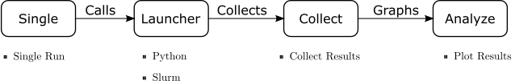

# A3 - Aaron's Automate Anything. 

This repository is a set of python scripts and methodology which can be used to easily automate any task.

The pieces of the automation are shown in this diagram.



## Dependencies

Before using, install included datastore python package.

See `requirements.txt` for additional requirements. They can be installed with 

```bash
pip install -r requirements.txt
```

## Usage
Update files with designed behavoir.

```bash
# Run a single task.
./0_single.py

# Launch all tasks.
./1_launcher.py

# Collect results.
./2_collect.py

# Analyze results.
./3_analyze.py

# Run all tasks
./run_all.sh
```